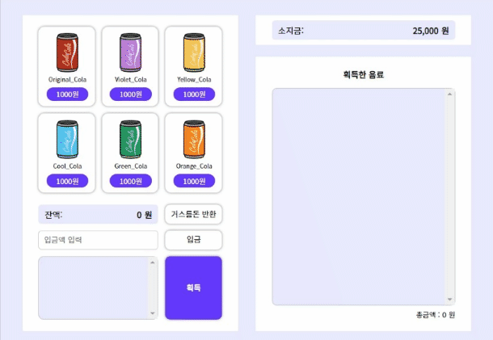

# Cola Cola Vending Machine
> [Cola Cola Vending Machine](https://donkeeman.github.io/VendingMachine)은 자판기의 동작을 시각화한 웹 사이트입니다.  

실제 자판기처럼 음료를 한 개씩 선택/선택 취소할 수 있고, 돈을 입금하면 선택한 음료를 획득할 수 있습니다.  
소지금을 추가할 수도 있고, 거스름돈 반환도 가능합니다.

## 지원되는 브라우저
---
>**경고:** Internet Explorer에서는 제대로 동작하지 않습니다.  

Chrome, Edge, Safari, Firefox 등의 타 브라우저 사용을 권장합니다.

## 개발 스택
---
- HTML
- CSS
- JavaScript (Vanilla)

## 기능 목록
---
### 콜라 선택

좌측 상단의 콜라 버튼을 누르면 좌측 하단의 리스트에 1개씩 추가됩니다.

### 콜라 선택 취소

좌측 하단의 리스트에서 콜라를 누르면 1개씩 차감되고, 0개가 되면 리스트에서 제거됩니다.

### 입금

입금액 입력 란에 원하는 만큼의 금액을 입력하면 잔액에 추가되고 소지금이 차감됩니다.  
입력한 금액이 소지금보다 많은 경우에는 alert 창이 출력됩니다.

### 콜라 구매

획득 버튼을 누르면 좌측 하단의 리스트에 있는 콜라들이 획득한 음료 리스트로 옮겨집니다.  
콜라의 가격만큼의 금액이 잔액에서 차감되고, 우측 하단의 총금액이 증가합니다.

### 거스름돈 반환

거스름돈 반환 버튼을 누르면 잔액 란의 금액을 소지금에 추가합니다.

### 콜라 품절

콜라의 재고 수량이 없다면 품절이라고 표시되고 더 이상 리스트에 추가할 수 없습니다.

### 소지금 입금

소지금 영역을 클릭하면 alert 창이 출력됩니다.  
입력한 금액만큼 소지금이 추가 또는 차감됩니다.

## 후기
---
### 어려웠던 부분
- fetch를 이용하여 비동기적으로 데이터를 받아오는 부분
- 동적으로 생성된 요소에 이벤트를 추가하는 부분
### 개선 사항
- index.js 파일을 TypeScript를 이용하여 수정하기

## 버그 제보 및 피드백
---
버그 제보 및 피드백은 언제나 환영합니다.  
PR을 하지 않더라도 [이슈](https://github.com/donkeeman/VendingMachine/issues)를 통해 편하게 제보해 주시면 시간이 되는 대로 수정하겠습니다.